# Machine-Learning-Music-Recommendation-System
This is my Machine Learning Engineer Nanodegree capstone project. In this project, I have built a music recommendation system that recommendation system that recommends songs for users based on their music taste. The model works by clustering users with similar music taste and selects a random song from the clusters most listened to songs to keep users exploring new songs. 

Interested? Take a look at the [Notebook](music_recommender.ipynb). 

## Data Exploration
Explored the dataset composed of 1000 rows and 14 features using statistics and several visualizations such as Histogram, Scatter Matrix, and Heatmap to find trends and relationships within the data.

### Statistics
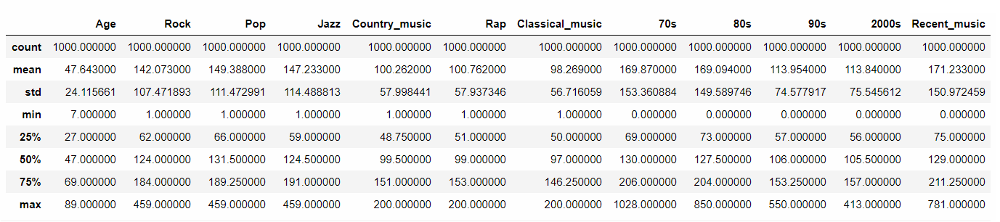

### Histograms Exploring Males vs Females Music Taste
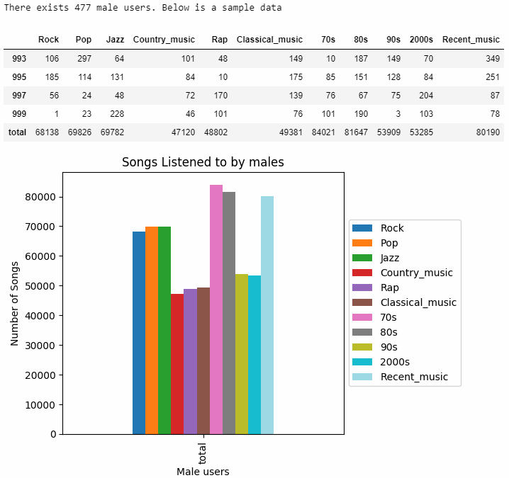 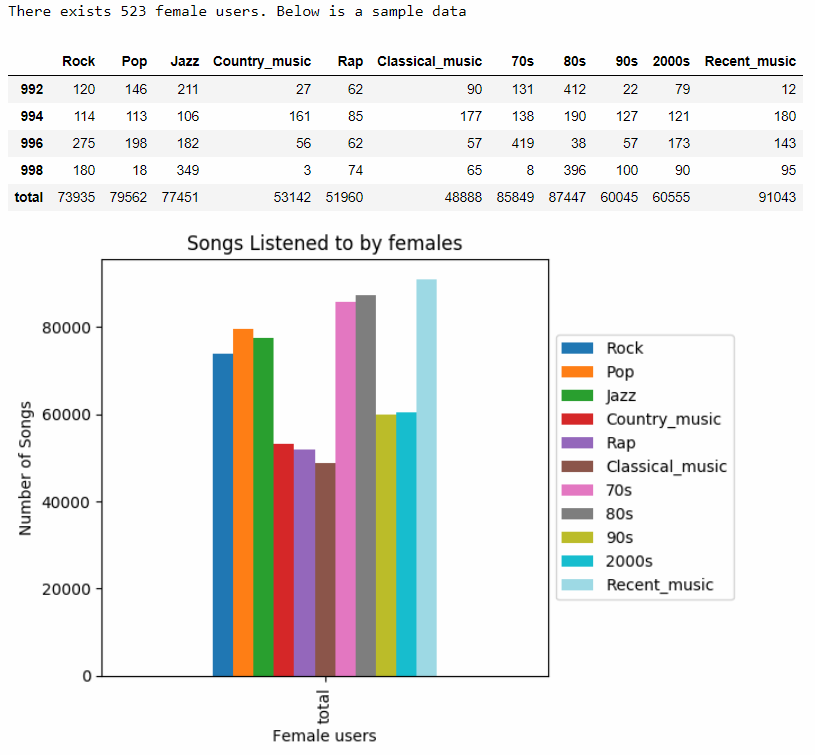

### Scatter Matrix Exploring Feature Relevance
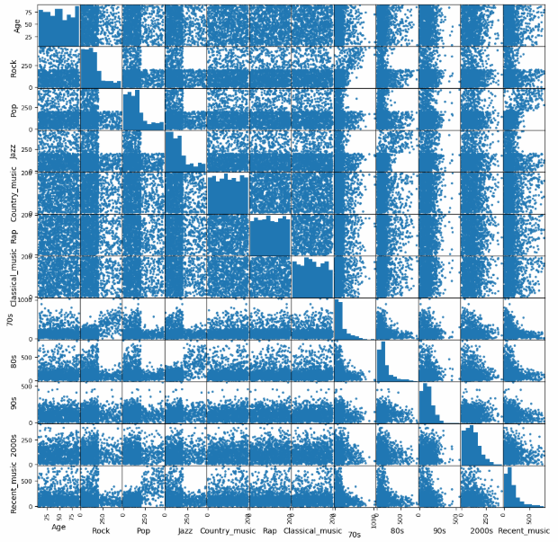

### Heatmap Exploring Features Correlation
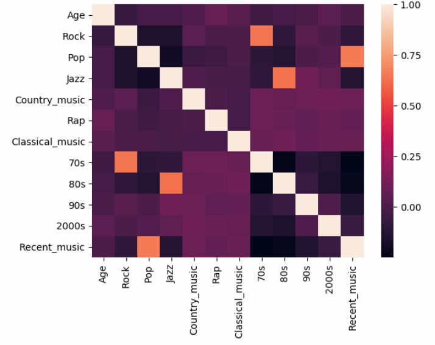

## Data Preprocessing and Visualizations
Processed the data to identify suspected outliers using Tukey Method, visualized them, and evaluated their removal/presence impact.

### Box Plot to Visualize Data Distribution and Outliers
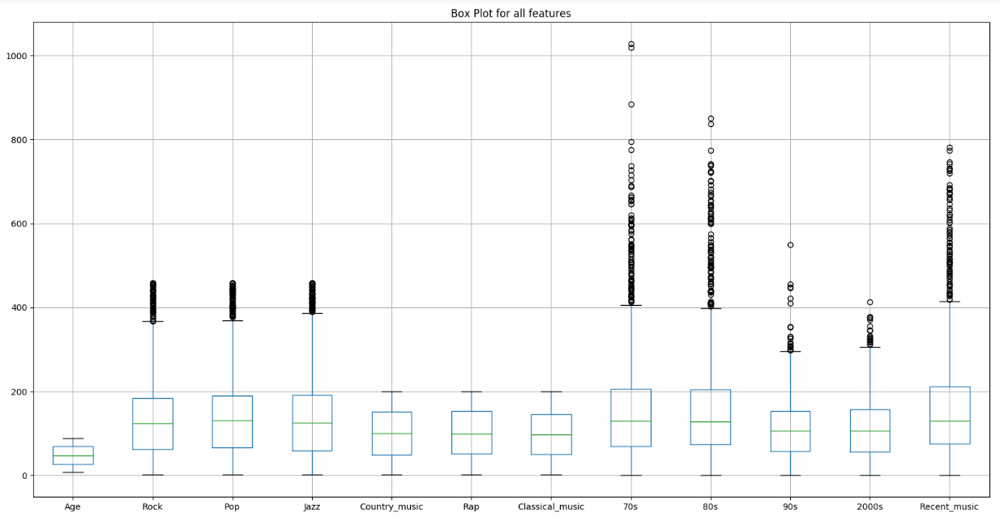

### Swarm Plot to Visualize The Data Distribution in a More Focused Manner
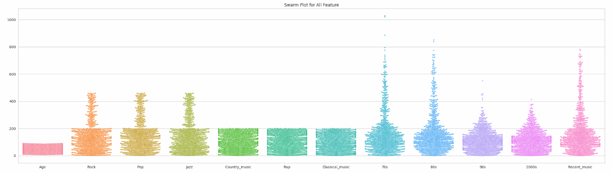

### Swarm/Box Plot to Analyze The Suspected Outliers
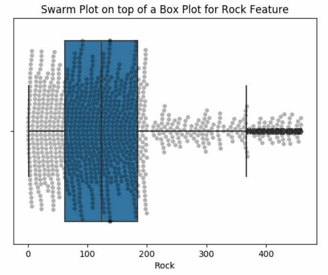

## Dimensionality Reduction
Applied PCA to reduce data dimensionality to 3 dimensions and visualized features projections over the selected principal components that best explains the variance.

### Principle Components Analysis for Reducing Dimensions 
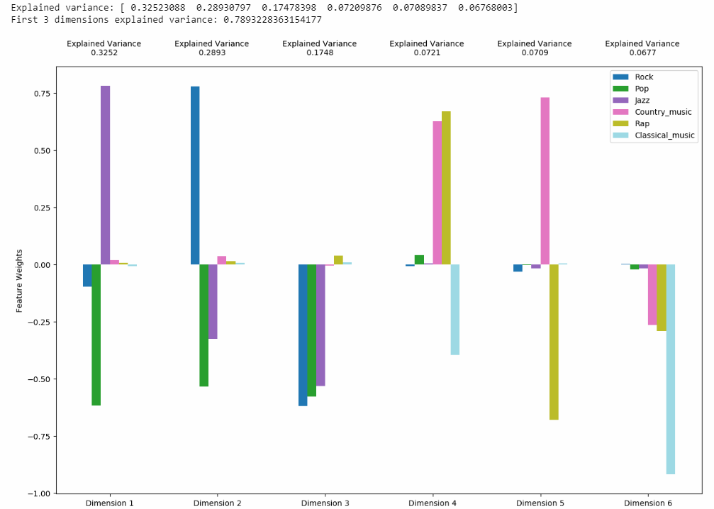

### PCA Cumulative Expected Variance
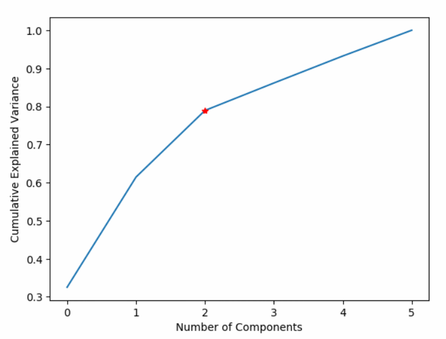

### PCA Feature Projection
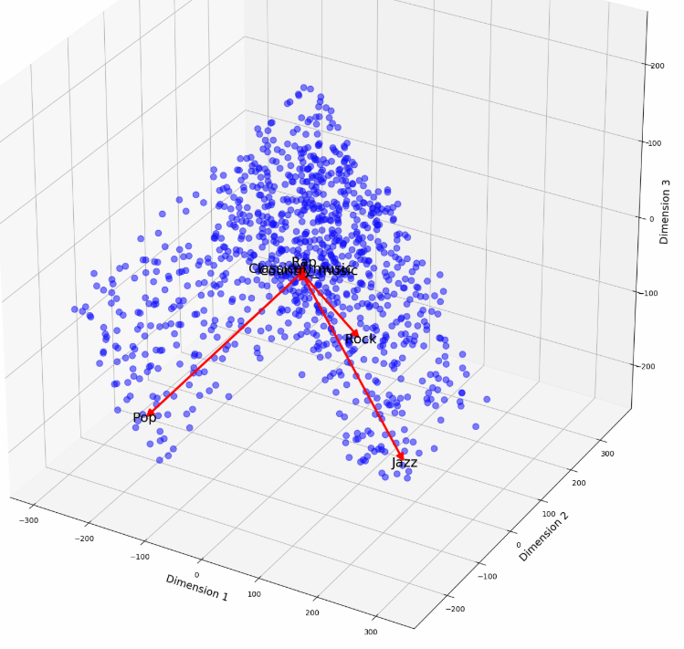

## Clustering
Clustered the users using K-means by finding the optimal number of clusters using Silhouette score and created a newly engineered feature representing a user segment.

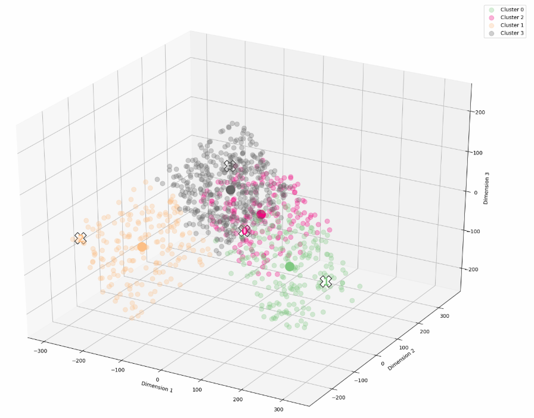

## Model Evaluation
Built a Decision Tree Classifier that predicts the engineered feature (cluster label or user segment) and used it as a Gold Standard to evaluate several random and greedy benchmarks using F1-Score. The model is capable of predicting the newly engineered feature while achieving a 99% accuracy compared to 8% and 28% for the random and greedy benchmarks.
